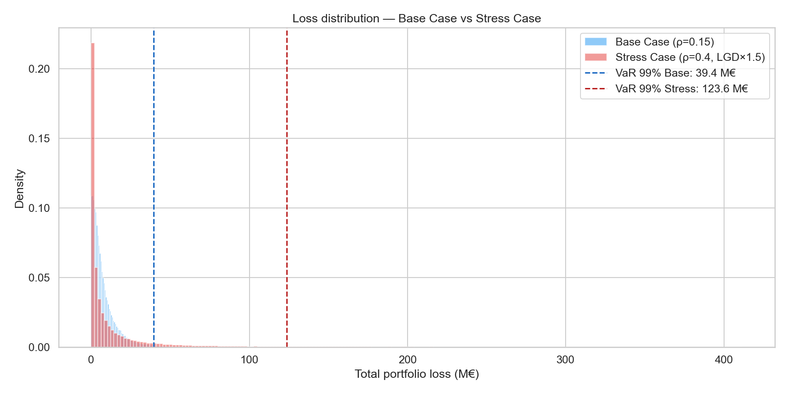

# Monte Carlo Credit Risk Simulation

> Credit risk simulator able to model extreme losses on a portfolio of 1,000 assets under a liquidity stress scenario, implemented in Python with 100,000 Monte Carlo scenarios.

---

## Methodology

The simulation engine is based on the **one-factor Gaussian copula (Vasicek)** model (Vasicek, 2002), widely used in the banking industry and by regulators (Basel II/III) to estimate regulatory capital.

### Vasicek Model — Latent Variable

For each borrower *i*, we define a latent variable:

$$X_i = \sqrt{\rho}\,Z + \sqrt{1-\rho}\,\varepsilon_i$$

| Symbol | Description |
|--------|-------------|
| $Z \sim \mathcal{N}(0,1)$ | Common systematic factor (economic cycle) |
| $\varepsilon_i \sim \mathcal{N}(0,1)$ | Idiosyncratic factor (individual risk) |
| $\rho$ | Asset correlation (systemic risk intensity) |

A **default** occurs if $X_i < \Phi^{-1}(PD_i)$, where $\Phi^{-1}$ is the inverse CDF of the standard normal distribution.

### Risk Metrics

| Metric | Formula | Interpretation |
|--------|---------|----------------|
| **Expected Loss** | $\text{EL} = \mathbb{E}[L]$ | Average expected loss |
| **Value-at-Risk** | $P(L \leq \text{VaR}_\alpha) = \alpha$ | Maximum loss not exceeded with probability $\alpha$ |
| **Expected Shortfall** | $\text{ES}_\alpha = \mathbb{E}[L \mid L \geq \text{VaR}_\alpha]$ | Average loss in the worst $(1-\alpha)\%$ scenarios |

### Stress Scenario — Liquidity Crunch

The stress test simulates a liquidity crisis by changing two parameters simultaneously:

| Parameter | Base Case | Stress Case | Effect |
|-----------|-----------|-------------|--------|
| $\rho$ (correlation) | 0.15 | 0.40 | Increased systemic contagion |
| LGD (multiplier) | ×1.0 | ×1.5 | Reduced recovery rates |

---

## Key Results

### Loss distribution — Base vs Stress



### Comparative metrics

| Metric | Base Case | Stress Case | Change |
|--------|-----------|-------------|--------|
| Expected Loss | ~7.85 M€ | ~11.79 M€ | +50% |
| VaR 99% | ~39.4 M€ | ~123.4 M€ | ×3.1 |
| Expected Shortfall 99% | ~50.2 M€ | ~168.2 M€ | ×3.4 |

> The Liquidity Crunch stress **triples** the 99% VaR, illustrating the non-linear effect of systemic correlation on tail losses.

---

## Project structure

```
Monte Carlo credit risk simulation/
├── config.yaml            # Simulation parameters (rho, N, confidence)
├── main.py                # Entry point — orchestrates the full pipeline
├── data_generation.py     # Generates a synthetic portfolio (1,000 loans)
├── simulator.py           # Monte Carlo Vasicek engine + matplotlib plot
├── visualize.py           # Interactive Plotly dashboard (HTML)
├── requirements.txt       # Python dependencies
├── portfolio.csv          # [Generated] Loan portfolio
├── stress_test_comparison.png  # [Generated] Base vs Stress plot
└── dashboard.html         # [Generated] Interactive dashboard
```

---

## How to run

### Prerequisites

- Python 3.10+

### Installation

```bash
git clone <repo-url>
cd "Monte Carlo credit risk simulation"
pip install -r requirements.txt
```

### Run

Run the full pipeline with a single command:

```bash
python main.py
```

This executes in sequence:
1. **Generate** portfolio → `portfolio.csv`
2. **Monte Carlo simulation** (Base + Stress) → `stress_test_comparison.png`
3. **Interactive dashboard** → `dashboard.html` (open in a browser)

### Run steps individually

Each step can also be run separately:

```bash
python data_generation.py     # Generates portfolio.csv
python simulator.py           # Runs simulations + plot
python visualize.py           # Generates the dashboard HTML
```

### Configuration

Edit `config.yaml` to adjust parameters without changing the code:

```yaml
simulation:
  n_simulations: 100_000
  confidence_level: 0.99

correlation:
  rho_base: 0.15
  rho_stress: 0.40

stress_test:
  lgd_multiplier: 1.5
  label: "Liquidity Crunch"
```

---

## Références

- Vasicek, O.A. (2002). *The Distribution of Loan Portfolio Value.* Risk, December 2002.
- Artzner, P., Delbaen, F., Eber, J.-M., Heath, D. (1999). *Coherent Measures of Risk.* Mathematical Finance, 9(3), 203–228.
-- Basel Committee on Banking Supervision (2006). *International Convergence of Capital Measurement and Capital Standards* (Basel II).
